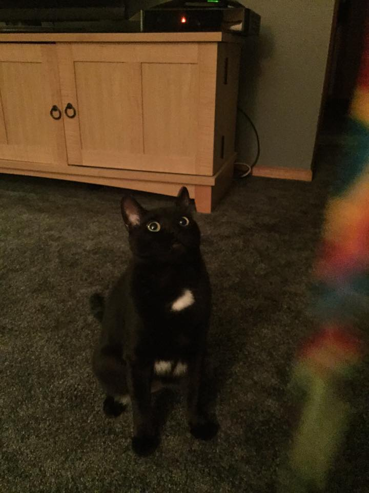

# Journal 2/12/2020

## What I learned today 

 - You can make an image a link in HTML
 - Small details like not closing a bracket, can mess up your entire file!
 - Do not type commands that start with "sudo" because you might delete your entire hard drive! 

## Git Bash

 - Command line cares about upper vs lower case
 - $ whoami > to see your username
 - $ ls > see what's on your computer
 - $ cd is a command, you have to tell it where to command ($ cd documents)
 - $ pwd > tells you where you are if you are lost in command line (print working directory)
 - $ cd .. >takes you one folder back
 - $ touch > new file
 - $ mkdir > new folder
 - Succeeding silently, you didn't get a help message
 - Start to type what you want, hit tab to fill in the rest! 
 - $ cat FILENAME.extention > shows you what is in that file

## CSS - Cascading Style Sheets

 - There is a heirarchy to these documents
 - Flexibility 
 - If you have a multi-page document, you could change every single heading style at once to be matching if you put the code in the right place
 - You can make things different colors and fonts
 - If you put your instructions at the top of the document, the whole document will obey those instructions
 - p.different would allow a section of your file to disobey the instructions for the entire document and instead follow the instructions given in p.different
 - This was not covered in class, but Professor mentioned Reddit, and I think Reddit uses CSS
 - Hit the up arrow to use the last command you used
 

# Here is a picture of my cat, Jack!

