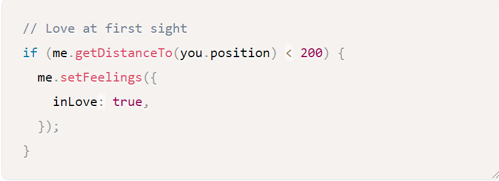

# 3/26/2020

## Takeaways
- I already did my two Walden comments earlier this week
- I have been researching coding poetry instead
- It exists! (coding poetry)
- I found articles (with examples) 
- https://www.smashingmagazine.com/2018/07/writing-code-poems/
- https://medium.com/s/art-of-code/on-code-and-poetry-a-conversation-5c7d0c19be00
- https://www.popwebdesign.net/popart_blog/en/2018/01/code-poetry-poems-written-in-programming-languages/

- Coding poetry is bilingual poetry 

## Example 

