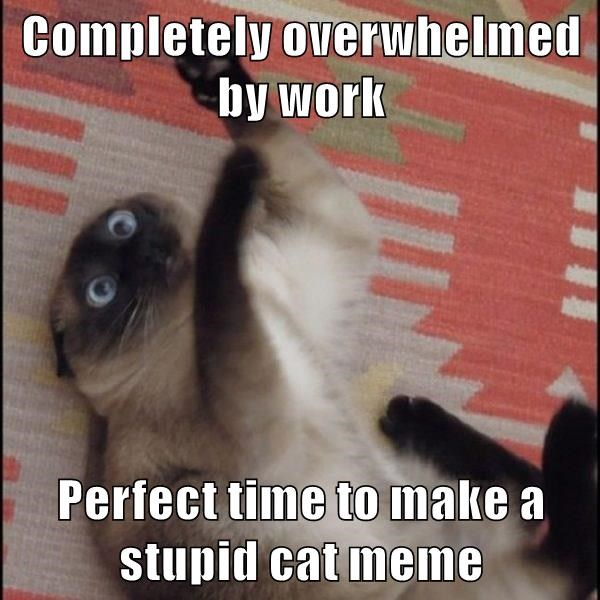

# 4/1/2020

## Notes

- Are there more assignments than there were yesterday? I'm looking at the things to do for this week, and it seems like a lot! 
- I love Emily Dickinson, happy to be analyzing one of her poems
- While I do appreciate the subtle differences in fluid texts, I am not a fan of analyzing them
- If anyone ever makes a fluid text version of my writing, I would be angry! I don't think that all authors intend to have their rough drafts analyzed. I think it's because I'm a huge perfectionist, but I can't imagine people reading things I write before they are "finished." I wonder how Dickinson, Thoreau, etc would feel about this
- I haven't had time to start the timeline yet because I have four other classes with just as many assignments, but I hope I will have more to write in these journals once I start it

### Looking at cat memes to procrastinate? I would never! 

