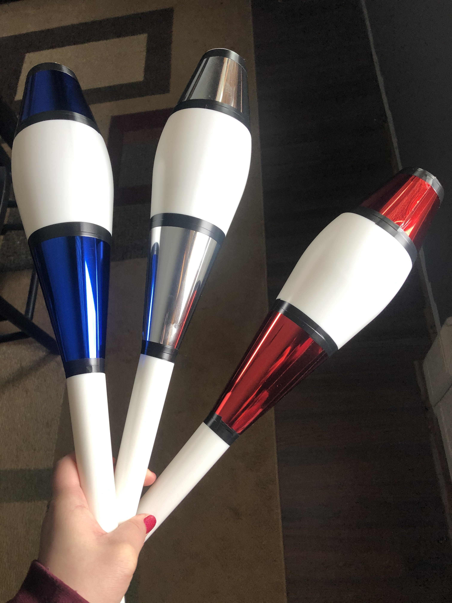

# 4/9/2020

## Notes

- Started my timeline for Walden today
- I am so confused about our final project, what is it? 
- What is XML/TEI?
- If I'm making a timeline of Walden now, do I have to make a different one for the final project?
- When it came to the Walden practice timeline, I just went nuts and put in all of the page 10s from each volume 
- Why page 10? Why not?
- The assignment says to just use placeholder text, so that's what I did
- The pictures load very slowly on the timeline, but they are all there
- I got the dates from digitalthoreau.org 
- I wasn't sure how to cite the photos in the timeline
- https://cdn.knightlab.com/libs/timeline3/latest/embed/index.html?source=1kKZ-ifq__5w09kccZAz6zHv770259OumPTwcsqBoFgw&font=Default&lang=en&initial_zoom=2&height=650

### I got new juggling clubs to keep myself from going insane! They are so shiny, have a great spin, and look awesome in the air!

