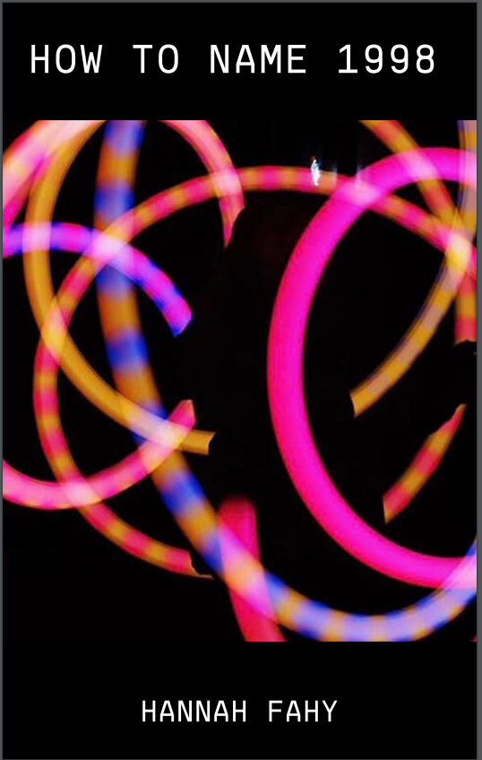

# 5/7/2020

## Notes? Thoughts? Who Knows?

- I highly recommend Glass Animal's new song and music video "Dreamland." It's the titular song to their upcoming album. The reason I recommend it, however, is because the music video is fantastic. Dave Bayley (lead singer) made the music video from his apartment in quarantine. He built an entire set and movie camera set-up in his living room, but then only used that footage for half of the video. The majority of the video is him, filming himself setting up the monstrosity of a set. It's hysterical, and it's a positive outcome of quarantine! https://www.youtube.com/watch?v=BE7vBk_zLA4
- I can't say my opinion on Thoreau has changed this semster, but I'm glad I got some coding skills. I think it's less the actual "skills" I got (because I'm not sure when I'll be coding book changes ever again), but it's more than I learned how to learn coding languages. I'm really grateful for that! 
- My brain really doesn't want to make two more comments on *Walden*, but I am not a quitter! 
- My mom and I have ordered way too much Panera lately. The delivery guy knows us by name.
- Maybe in 2022 (when I'm finally a teacher but we're still in quarantine because it's my dystopian fever dream) I'll have my students do all their classwork via GitHub repositories.
- Just checked in with my brain, it still refuses to write two comments in *Walden.*
- I uploaded my group's TEI file! Just waiting for the pull request to be accepted!
- I vaguely know how to code, why am I not a billionaire yet? I thought you just needed to know how to code to get rich....
- I think I'll make a comment on "House Warming." I wonder how many times I've reread *Walden* this semester just trying to find a paragraph to comment on.
- Even though Digital Humanities isn't exactly my cup of tea, I had a really good time in this class this semester. I feel like I've learned a lot. It wasn't at all what I expected, and I think that's for the better. Thank you for this semster and for being really accomodating with all the craziness! 
- Just to make it full circle in this journal, Glass Animals is a great band, listen to all of their music. All of it is amazing. 

### Here is the cover for the "mini chapbook" I've been working on in ENGL 301! It's a picture of me spinning poi (which is another circus art)

